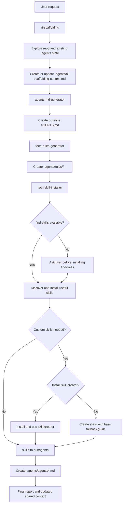

# ai-scaffolding-skill

Portable skill suite for bootstrapping and evolving an AI scaffolding inside a software project.

The suite is designed so each skill can run independently, but the ideal workflow is to install them all and let `ai-scaffolding` orchestrate the full process from one entry point.

## Goal

These skills help you:

- Discover the real state of a repository,
- Create or refine `AGENTS.md`,
- Generate modular tech rules in `.agents/rules/`,
- Discover and install supporting skills for the project stack,
- Design and create subagents from the installed/local skill set,
- Keep all decisions in a shared context file: `.agents/ai-scaffolding-context.md`.

## Included skills

This repo contains these project-owned skills:

- `ai-scaffolding`
- `agents-md-generator`
- `tech-rules-generator`
- `tech-skill-installer`
- `skills-to-subagents`

## Recommended installation strategy

The recommended setup is to install the full suite:

```bash
npx skills add <your-user>/ai-scaffolding-skill --skill '*'
```

That gives `ai-scaffolding` everything it needs for the normal orchestration flow.

You can still install a single skill and use it independently, for example:

```bash
npx skills add <your-user>/ai-scaffolding-skill --skill ai-scaffolding
```

## Recommended companion skills

These are not included in this repository, but they are recommended:

- `find-skills`
  - used by `tech-skill-installer`
  - if it is missing, the workflow must ask the user before installing it
- `skill-creator`
  - optional but recommended when the installer detects missing custom skills
  - if it is missing, `ai-scaffolding` asks the user whether to install it
  - if the user declines, `ai-scaffolding` falls back to a basic manual skill creation path

## How the suite works

High level behavior:

- Every skill can run on its own.
- `ai-scaffolding` is the orchestrator skill.
- It explores the repo first and persists shared state in `.agents/ai-scaffolding-context.md`.
- Companion skills read that file first when it exists, reuse its answers, and only ask for missing information.
- `ai-scaffolding` validates required skills, handles missing dependencies, and updates the context after every stage.

## Flow diagram



## Dependency policy

The suite is intentionally conservative with external skill dependencies:

- No external skill should be installed silently.
- `find-skills` requires explicit user approval before installation.
- `skill-creator` requires explicit user approval before installation.
- If `skill-creator` is not installed, the workflow still completes using the built-in fallback guidance.

## Structure

```text
ai-scaffolding-skill/
  skills/
    ai-scaffolding/
    agents-md-generator/
    tech-rules-generator/
    tech-skill-installer/
    skills-to-subagents/
```

Each skill may include:

```text
<skill-name>/
  SKILL.md
  references/
  scripts/
  assets/
```

## Install with npx skills

List available skills:

```bash
npx skills add <your-user>/ai-scaffolding-skill --list
```

Install all skills from this repo:

```bash
npx skills add <your-user>/ai-scaffolding-skill --skill '*'
```

Install one skill:

```bash
npx skills add <your-user>/ai-scaffolding-skill --skill ai-scaffolding
```

## Suggested usage

Best entry point:

```text
/ai-scaffolding bootstrap this project for Java
```

Independent usage examples:

```text
/agents-md-generator
/tech-rules-generator Java
/tech-skill-installer React frontend
/skills-to-subagents verification workflow
```

## Contributing

Contributions are welcome.

- See `CONTRIBUTING.md` for the recommended workflow to add new skills or improve existing ones.
- The project is released under the MIT license in `LICENSE`.
